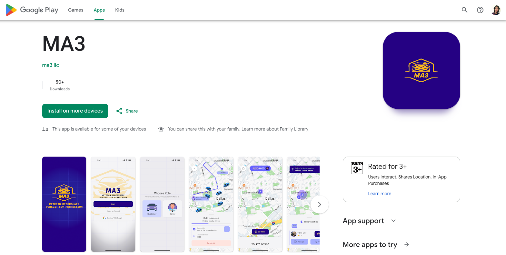
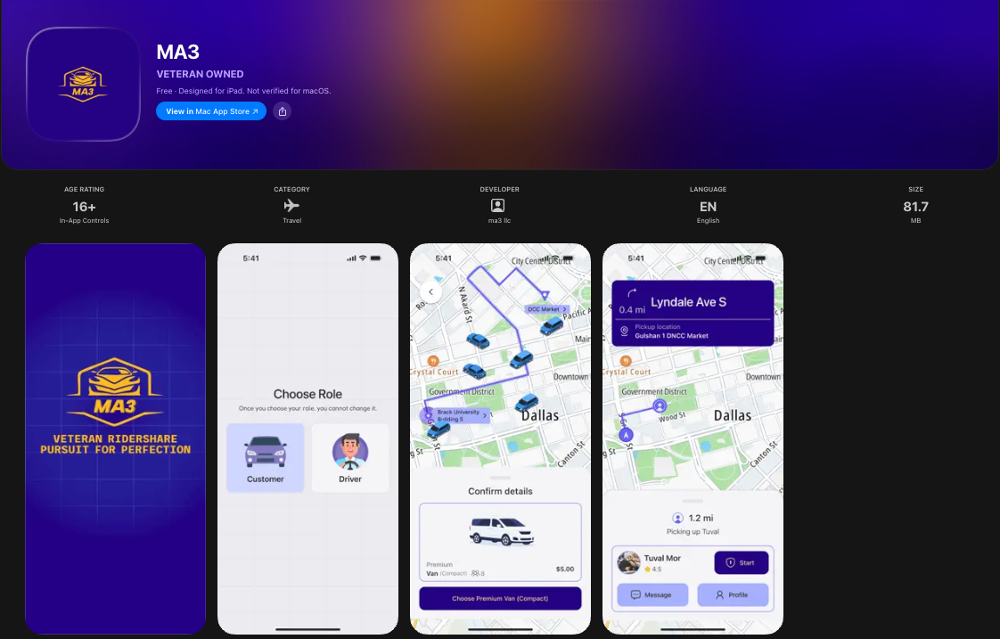

# MA3: Next-Gen Ride Sharing App 🚗

> A modern, fast, and secure cross-platform ride-hailing and driver management application built with React Native and Expo. Seamlessly connecting riders and drivers with real-time routing, instant messaging, live tracking, and frictionless payment processing.

[](https://play.google.com/store/apps/details?id=co.ma3llc)
[](https://apps.apple.com/us/app/ma3/id6762648482)

---

## 🔗 Live Downloads

- **Google Play Store (Android):** [Download on Google Play](https://play.google.com/store/apps/details?id=co.ma3llc)
- **Apple App Store (iOS):** [Download on the App Store](https://apps.apple.com/us/app/ma3/id6762648482)

---

## 📸 App Showcase

MA3 is live in production across both iOS and Android, connecting riders with dependable transportation and providing drivers with seamless onboarding, route navigation, and instant payouts:

| Google Play Store | Apple App Store |
| :---: | :---: |
|  |  |

---

## 🛠️ Tech Stack & Key Learnings

Building MA3 involved engineering resilient, real-time mobile infrastructure tailored for high-availability mobility services:

1. **React Native for iOS & Android (Expo & Native Architecture)**
   - Engineered a unified cross-platform mobile codebase leveraging **Expo SDK 54** and **React Native 0.81** with the **New Architecture** enabled.
   - Designed responsive, modular UI layouts using **Expo Router** (file-based typed routing), 60 FPS gesture-driven motion with **React Native Reanimated**, and fluid modal sheets via `@gorhom/bottom-sheet`.

2. **Google Maps API & Route Navigation**
   - Implemented interactive map experiences via **React Native Maps** (`react-native-maps`) and destination discovery using **Google Places Autocomplete**.
   - Integrated live coordinate mapping, custom vehicle marker rotations, dynamic polyline rendering, and automated camera viewport bounds fitting for trip routes.

3. **High-Precision Location Services**
   - Utilized **Expo Location** (`expo-location`) for battery-conscious, high-accuracy GPS tracking and geocoding.
   - Handled runtime permission lifecycles, user coordinate streaming, live distance calculations, and real-time pickup accuracy for smooth ride fulfillment.

4. **Stripe Connect & Secure Payment Infrastructure**
   - Built a comprehensive payment and payout system utilizing **Stripe React Native** (`@stripe/stripe-react-native`).
   - Integrated customer card tokenization, 3D Secure verification, and **Stripe Connect** express onboarding for drivers with automated identity verification and instant payout direct deposits.

5. **Socket.IO for Real-Time Messaging & Trip Synchronization**
   - Architected a duplex, low-latency WebSocket connection layer using **Socket.IO Client** (`socket.io-client`).
   - Powered instant driver-rider chat with read receipts, real-time driver coordinate broadcasts, dynamic trip status updates (requested, accepted, arriving, started, completed), and cancellation events.

6. **Predictable State & Schema Validation**
   - Managed complex asynchronous data caching, authentication sessions, and real-time ride states using **Redux Toolkit** and **RTK Query**.
   - Enforced type-safe inputs and robust client-side validation across multi-step registration and vehicle onboarding flows with **React Hook Form** and **Zod**.

---

## ✨ Core Features

- **Dual Experience (Rider & Driver):** Tailored role-based interfaces supporting rider bookings and driver trip fulfillment.
- **Intuitive Ride Booking & Fare Estimates:** Fast search via Google Places, transparent upfront pricing, and multi-tier vehicle category selection.
- **Live GPS Tracking:** Real-time driver vehicle visualization on the map with live ETA and optimized polyline routing.
- **In-App Real-Time Messaging:** Instant, bidirectional rider-driver chat to coordinate pickup points and special requests.
- **Driver Onboarding & Vehicle Verification:** Structured check-list for document submissions (license, vehicle registration, background checks) and Stripe Express payout configuration.
- **Secure Payments & Digital Receipts:** One-tap payments powered by Stripe, transaction histories, and itemized ride receipts.
- **Safety & Verification:** Ride security PIN verification before trip start, emergency contact access, and trip status history.

---

## 💻 Running the Project Locally

### Prerequisites
- **Node.js:** v18 or v20+ recommended
- **Java Development Kit (JDK):** JDK 17 recommended
- **Android Studio & Android SDK:** Configured with `ANDROID_HOME` environment variables (for Android builds)
- **Xcode & CocoaPods:** macOS only (for iOS builds)
- **Package Manager:** npm or yarn

### Installation & Execution

1. **Clone the repository:**
   ```bash
   git clone https://github.com/mohammad-al-asad/ride-share-app.git
   cd ride-share-app
   ```

2. **Install dependencies:**
   ```bash
   npm install
   ```

3. **Configure Environment Variables:**
   Create a `.env` file in the root directory and populate your keys:
   ```env
   EXPO_PUBLIC_API_URL=https://api.ma3llc.co/
   EXPO_PUBLIC_MAP_API_KEY=your_google_maps_api_key
   EXPO_PUBLIC_STRIPE_PUBLISHABLE_KEY_TEST=your_stripe_publishable_key
   ```

4. **Run on Android:**
   ```bash
   npx expo run:android
   ```

5. **Run on iOS (macOS only):**
   ```bash
   npx expo run:ios
   ```

6. **Start Expo Development Server:**
   ```bash
   npx expo start
   ```
